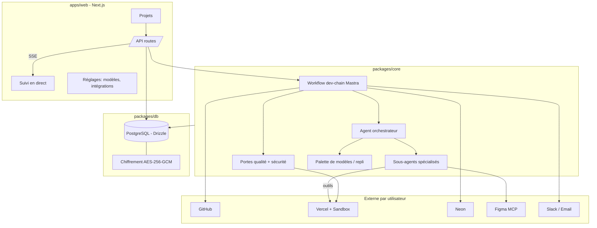

# Architecture

## Vue d'ensemble

MasterAI est une plateforme qui **fabrique et déploie des applications** à partir d'un cahier
des charges, en orchestrant des agents Mastra. Elle sépare trois plans :

1. **La plateforme** (ce dépôt) : UI, base de données, orchestration.
2. **Les agents** : rôles spécialisés, avec palette de modèles et outils.
3. **Le projet généré** : code produit dans une sandbox, poussé sur GitHub, déployé sur Vercel.

## Workflow de la chaîne (`packages/core/src/workflows/dev-chain.ts`)

Étapes séquentielles avec une boucle `.dowhile` au cœur :

1. **analyze** — l'analyste produit des specs structurées (Zod) : user stories + critères Gherkin.
2. **plan** — l'architecte choisit la stack (imposée par le cahier des charges, sinon stack de
   référence), rédige `ARCHITECTURE.md`, `API.md` et découpe en tâches.
3. **bootstrap** — DevOps crée le dépôt (ou clone l'existant), provisionne Neon, crée le projet
   Vercel ; l'agent UX/UI produit le design system (et des maquettes Figma si connecté).
4. **build** — l'orchestrateur (agent supervisor Mastra avec `agents:` = sous-agents) délègue
   chaque tâche au bon développeur, qui écrit code **et** tests, puis ouvre une PR.
5. **iterate** (boucle) — exécute les portes qualité + revue de code ; en cas d'échec, délègue
   les corrections. Répété jusqu'au vert, avec détection de stagnation et escalade de modèle.
6. **deploy** — déploiement staging, contrôles santé/Lighthouse, puis production automatique
   seulement si tout est vert, avec rollback si le contrôle de santé échoue.
7. **report** — rapport détaillé, statut du projet, notification.

L'état de la chaîne (`ChainData`) est sérialisable : Mastra persiste les snapshots, ce qui rend
l'exécution reprenable. Les **secrets ne transitent pas** dans cet état ; seul `runId` y figure,
et le contexte complet (clés déchiffrées) est rechargé en mémoire via `loadRuntime`.

## Portes qualité (`packages/core/src/gates`)

Logique **déterministe et testée unitairement**, séparée des agents :

- `parsers.ts` : lecture des sorties JSON des outils (couverture, Semgrep, Trivy, OSV, Gitleaks,
  Lighthouse, ZAP, Nuclei).
- `evaluate.ts` : application de la politique (`DEFAULT_QUALITY_POLICY` : couverture ≥ 90 %,
  vulnérabilités High/Critical bloquantes, Lighthouse a11y ≥ 90).
- `loop-policy.ts` : décision de la boucle (corriger / escalader / arrêter) via l'empreinte des
  échecs (résistante aux nombres volatils).
- `runner.ts` : orchestration de l'exécution des contrôles dans la sandbox.

## Palette de modèles (`packages/core/src/lib/models.ts`)

S'appuie sur le routeur de modèles de Mastra (`PROVIDER_REGISTRY`, 200+ fournisseurs). Chaque
agent déclare une liste `models` (principal + repli). `resolveModelChain` construit la chaîne de
repli attendue par Mastra en n'incluant que les fournisseurs pour lesquels l'utilisateur a une
clé, et fait tourner l'ordre selon le niveau d'escalade de la boucle.

## Multi-tenant

Toutes les tables portent un `tenantId` et les accès passent par un `TenantContext`. La V1
résout un tenant/utilisateur par défaut ; brancher une authentification ne touche qu'à
`apps/web/src/lib/session.ts`.
